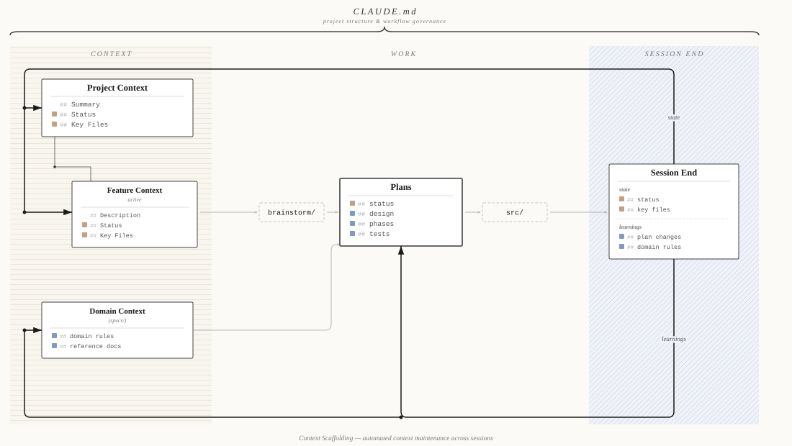

# Context Scaffolding Plugin

Persistent memory for Claude Code. This plugin gives Claude the ability to remember what your project is, what you're working on, and what it's learned — across every session. No more re-explaining context. You pick up exactly where you left off.

## How It Works

The plugin maintains structured context that loads at session start, informs your work, and updates itself at session end.

**Context** — A **Project Context** provides the high-level orientation: what the project is, its current state, and key files. Each feature branches from the project as a **Feature Context** with its own description, status, and key files. Separately, **Domain Context** (`specs/`) holds domain rules and reference docs that inform planning.

**Work** — The active feature's context feeds into `brainstorm/` and then into **Plans**, which are the centerfold of the system. Plans hold the design, phases, status, and tests for each feature — they are the source of truth that `src/` implementation derives from. If the plans are accurate, everything downstream can be trusted.

**Session End** — Two streams are extracted and written back:
- ***State*** updates flow back to **Project Context** and **Feature Context** — keeping status and key files current for the next session.
- ***Learnings*** flow back to **Plans** (plan adjustments) and **Domain Context** (newly discovered domain rules) — strengthening the knowledge base over time.

**CLAUDE.md** governs the entire structure — it defines the folder organization (`brainstorm/`, `specs/`, `plans/`, `src/`), development rules, and file conventions that make this loop possible.



## Getting Started

### Install the plugin

```bash
# From a local marketplace
/plugin install context-scaffolding-plugin@my-plugins

# Or directly from GitHub
/plugin marketplace add https://github.com/aam3/context-scaffolding-plugin
/plugin install context-scaffolding-plugin@context-scaffolding-plugin
```

### Initialize your project

```bash
/context-scaffolding-plugin:system:init
```

This sets up your project's governance layer: a `CLAUDE.md` file assembled from your documentation, a reference catalog, and the standard directory structure (`brainstorm/`, `specs/`, `plans/`, `src/` with their subdirectory CLAUDE.md files). If you don't have documentation yet, init walks you through a short Q&A to draft one from scratch. Safe to re-run anytime.

### Start your first session

Context loading happens automatically. When a new session begins, Claude will:

1. Walk you through creating a **project primer** — a short orientation doc covering what the project is, where it stands, and which files to read for context. Claude checks existing sources (`CLAUDE.md`, `specs/`) before asking you to describe the project from scratch.
2. Help you define a **feature** — what you're working on today, described in your own words.
3. Load everything and start working with full awareness of your project.

From the second session onward, this context is loaded automatically with no setup needed.

## What It Does

### Remembers your project

Claude starts every session knowing what your project is and where it stands. A project primer captures the high-level overview, current trajectory, and key files — and it's automatically updated at the end of each session to reflect progress.

### Tracks your features

Each feature you work on gets its own context file with a status (`brainstorming`, `designing`, `planning`, `building`, `complete`), a description, and the specific files that matter for it. Sub-features are supported for organizing larger efforts. When you return to a feature, Claude already knows its history and relevant code.

```
.claude/commands/prime/
├── project-primer.md
└── features/
    ├── auth-system.md
    ├── data-pipeline.md
    └── ...
```

### Structures your workflow

Work flows naturally through the project folders:

- **`brainstorm/`** — Early ideation and design exploration
- **`specs/`** — Stable project specifications (what and why)
- **`plans/`** — Scoped by context: `project/` for project-wide plans, `features/{name}/` for feature plans (routed automatically based on the active feature)
- **`src/`** — Implementation code, organized by the project's conventions

### Learns as you work

When Claude gets corrected, discovers a domain edge case, or deviates from a plan, those insights are captured and routed to the right place:

- **Development rules** (like "always run tests after editing src/") go into `CLAUDE.md` so they govern future behavior.
- **Domain knowledge** (like "invoices must include tax in EU regions") gets integrated into the relevant specs.
- **Plan changes** (like "switched from REST to GraphQL") update the actual plan files.

This happens both mid-session (on demand) and at session end (as a safety net). Learnings are integrated contextually, not just appended to the bottom of a file.

### Keeps a session history

The plugin maintains a rolling log of recent sessions — what moved forward, which features were touched, and which parts of the codebase were affected. This history feeds the project primer's "current state" section, keeping it at trajectory altitude: "auth system in active development, data pipeline complete" rather than a list of tasks.

### Generates and maintains CLAUDE.md

Your project's `CLAUDE.md` is assembled from source documentation — condensed, organized into sections, and combined with a reference catalog. It's rebuilt when you re-run init, but the Development Rules section (which accumulates learnings over time) and any custom sections you've added are always preserved.

## Commands

| Command | Purpose |
|---|---|
| `/context-scaffolding-plugin:system:init` | Set up a new project. Creates `CLAUDE.md`, the folder structure (`brainstorm/`, `specs/`, `plans/`, `src/`), and the reference catalog. Re-run to rebuild. |
| `/context-scaffolding-plugin:system:summarize-conversation` | Capture learnings mid-session. Run anytime, as often as you like. |
| `/context-scaffolding-plugin:system:summarize-session` | Wrap up a session. Records progress, updates all context, saves learnings. |

## Requirements

- Claude Code v1.0.33+
